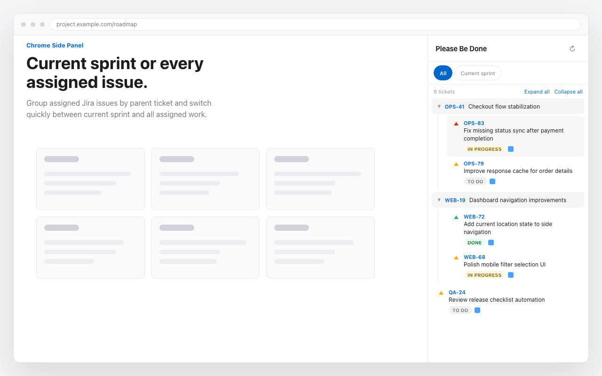
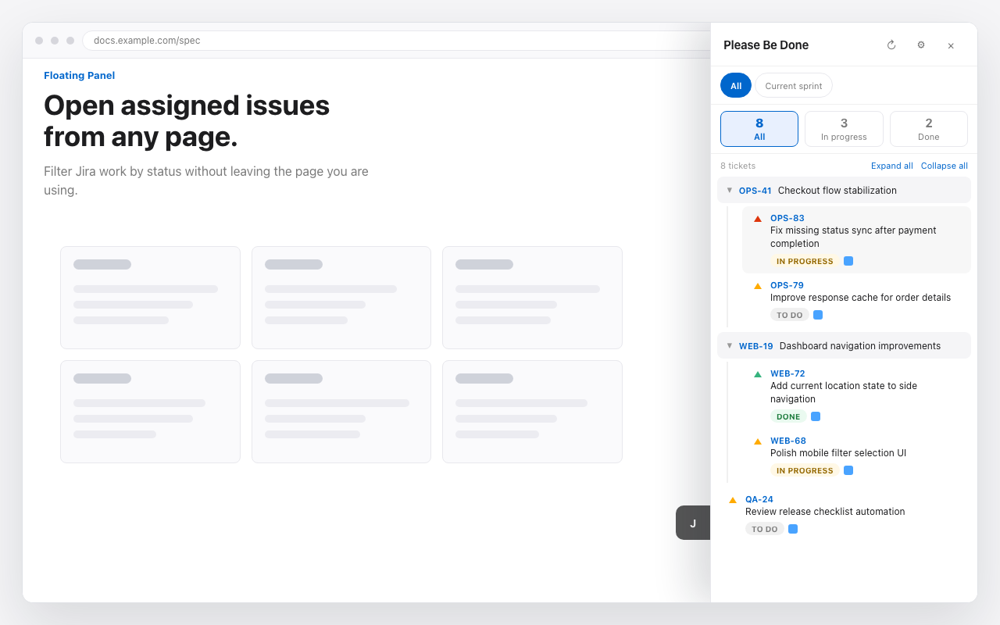
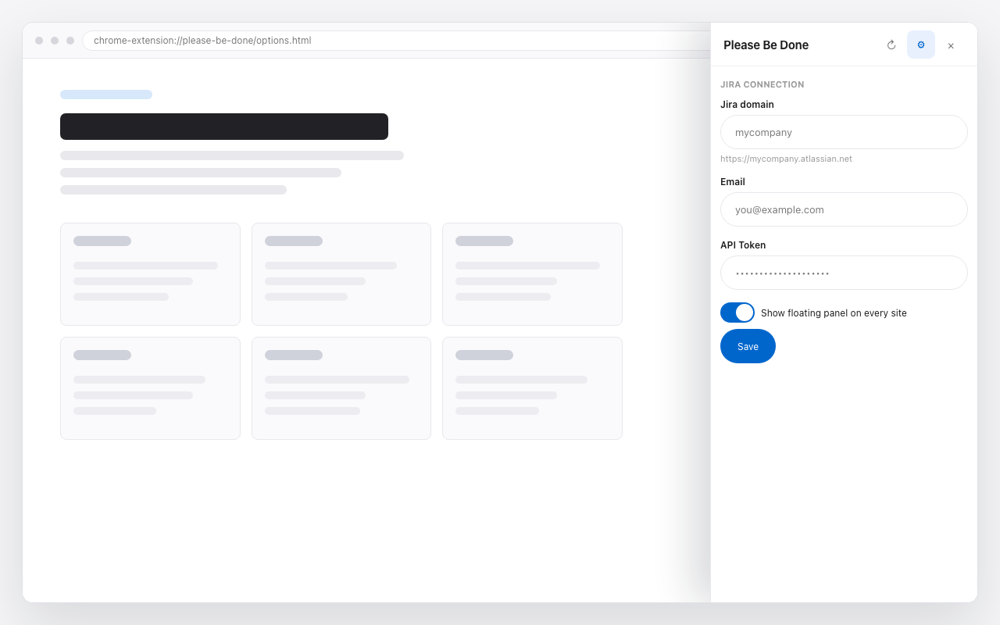

# Please Be Done

A Chrome extension for quickly checking Jira issues assigned to you from the Chrome Side Panel or an in-page floating panel.

## What It Does

- Shows Jira issues assigned to you in the Chrome Side Panel.
- Provides a floating panel for quick access while browsing.
- Lets you switch between current sprint issues and all assigned issues.
- Groups child issues under their parent issue.
- Lets you collapse, expand, and filter issue lists.
- Opens Jira issues in one click.

## Screenshots

### Side Panel

### Floating Panel

### Settings

## Requirements

- Chrome 114 or later
- Jira Cloud workspace under `*.atlassian.net`
- Atlassian API token for your Jira account

## Setup

1. Create an Atlassian API token from [Atlassian API Tokens](https://id.atlassian.com/manage-profile/security/api-tokens).
2. Open the Please Be Done settings page.
3. Enter your Jira connection details:
   - **Domain**: the Jira subdomain only, for example `mycompany` for `mycompany.atlassian.net`
   - **Email**: your Atlassian account email
   - **API Token**: the Atlassian API token you created
4. Save the settings.
5. Open the Chrome Side Panel or floating panel to view your issues.

## How To Use

- Use the side panel when you want a persistent issue list beside your browser tab.
- Use the floating panel when you want quick access without leaving the current page.
- Switch between **Current Sprint** and **All** depending on the issue list you need.
- Collapse issue groups to keep long lists easier to scan.
- Click an issue key or title to open the issue in Jira.

## Privacy

Please Be Done does not send Jira data to any external server owned by this project.

- Jira domain, email, API token, preferences, and issue cache are stored in Chrome storage.
- Jira API requests are sent directly from the extension to your configured Jira Cloud site.
- The extension does not use cookies, analytics, or tracking.

See [privacy.html](privacy.html) for the full privacy policy.

## Troubleshooting

- If issues do not load, confirm your Jira domain, email, and API token are correct.
- If the current sprint view is empty, check the **All** view to confirm assigned issues exist.
- If authentication fails, create a new Atlassian API token and save it again in settings.
- If a Jira issue does not open, confirm your Jira domain is entered without `https://` or `.atlassian.net`.
